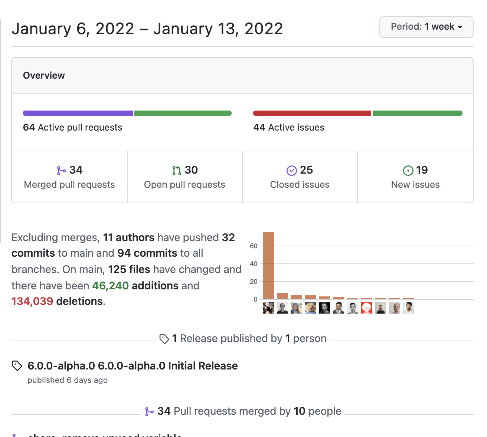

# Faker 团队的更新

_2022 年 1 月 14 日_

:wave: 我们很高兴为这个项目赋予新的活力。

我们希望这个项目有一个新的开始，变得*更酷*。

[[toc]]

## 什么是 Faker？

Faker 是一个为您生成虚假（但合理）数据的库。模拟用于测试、开发等的数据。

**Faker 于 2004 年由 Jason Kohles 首次在 Perl 中实现**（[他在讨论中表示愿意提供帮助 💛](https://github.com/faker-js/faker/discussions/55)）此后该项目被移植到多种语言上，如 [Ruby](https://github.com/faker-ruby/faker)、[Python](https://faker.readthedocs.io/en/master/)、[Java](https://github.com/DiUS/java-faker)、[Clojure](https://github.com/paraseba/faker) 和 [PHP](https://fakerphp.github.io/)。

这是 Faker 的 JavaScript 版本。

## 它叫 Faker 还是 faker.js？

我们尝试在代码和标题中将其称为 Faker，但 faker-js 更适合用作用户名。

## 这是官方库吗？

我们在短期内将其称为官方库，以消除许多非社区维护的重构和分支之间的歧义。迄今为止，我们已经 [合并了所有活跃的分支](https://twitter.com/faker_js/status/1481918305669627905/photo/1)。一旦事情平息，项目周围的混乱就会减少，我们就会放弃“官方”。

## （某人）也在开发一个 Faker 库

请将它们发送到我们的 [Discord](https://discord.gg/k4bPM5dzqC)，我们可以分享想法并共同协作。

## 目前的维护者是谁？

当主包被删除时，我们是一群在生产中使用 Faker 的工程师。

我们目前有八名维护者。

- Damien Retzinger - [GitHub](https://github.com/damienwebdev), [Twitter](https://twitter.com/damienwebdev)
- Shinigami - [Github](https://github.com/Shinigami92), [Twitter](https://twitter.com/Shini_92)
- Daniel Bannert - [Github](https://github.com/_prisis_), [Twitter](https://twitter.com/_prisis_)
- Erica Clark - [GitHub](https://github.com/clarkerican), [Twitter](https://twitter.com/clarkerican)
- Mo Mahallawy - [GitHub](https://github.com/mmahalwy), [Twitter](https://twitter.com/mmahalwy)
- griest - [GitLab](https://gitlab.com/griest)
- Mateus Dadalto - [GitHub](https://github.com/MateusDadalto), [Twitter](https://twitter.com/MateusD)
- Jessica Sachs - [GitHub](https://github.com/JessicaSachs), [Twitter](https://twitter.com/_JessicaSachs)

## 到目前为止，团队做了什么？

1. 在 `@faker-js/faker` 下为新的 Faker 包创建了 [GitHub 组织](https://github.com/faker-js/faker)。
2. 组建一个由**八名**维护成员组成的团队。
3. 在 npm 上的 [`@faker-js/faker`](https://npmjs.com/@faker-js/faker) 包中发布了以前所有版本的 Faker。
4. 发布了第 6 版的 Alpha 版本。
5. 几乎完成了向 TypeScript 的迁移，因此 definitelyTyped 不再需要维护其外部 [@types/faker](https://www.npmjs.com/package/@types/faker) 包。
6. 创建了一个公共 [Twitter](https://twitter.com/faker_js) 帐户，用于与社区进行交流。
7. 发布了第一个官方 [Faker 文档网站](https://fakerjs.dev)。

::: tip 谢谢你，Jeff！
Faker 从未有过官方文档网站，而令人敬畏的 [Jeff Beltran](https://github.com/JeffBeltran) 在过去 3 年中一直在维护一个名为 “[非官方 faker.js 文档](https://github.com/JeffBeltran/faker.js-docs)” 的项目。

他允许我们重新使用他的项目来创建 **[fakerjs.dev](https://fakerjs.dev)**。
:::

8. 清理了 Prettier、CI、Netlify Deploy Previews 和 GitHub Actions 等工具。
9. 完成了大量的问题分类和许多许多 PR 审查。

10. 我们已经与 [Open Collective](https://opencollective.com) 取得了联系，并讨论了该项目的过渡计划。

## 有路线图吗？

我们打算扩展 Faker，不断开发它，让它变得更好。

因此，我们将在发布 6.x 版本后制定路线图，并在下周合并所有 TypeScript 拉取请求。

我们路线图中的一些项目：

1. ESM 支持
2. 从 Browserify 迁移到 Rollup/Vite
3. 改进过的代码测试系统
4. TypeGen 文档
5. 与 Faker 生态系统的现有维护者互动
6. 文档中的交互式体验区
7. Node 18 兼容性

## 我听说发生了一些事情，有简要说明吗？

Faker 项目先前由 Marak Squires 维护。Marak Squires 是一位早期有影响力的 Node 爱好者和专业人士。但他于 2022 年 1 月 4 日做出了一些 [流氓和恶意行为](https://www.bleepingcomputer.com/news/security/dev-corrupts-npm-libs-colors-and-faker-breaking-thousands-of-apps/)，于是该包被删除，该项目被放弃。

我们现在正在将 Faker 变成一个**由社区控制**的项目，目前由来自不同背景和公司的八名工程师维护。

::: tip 新闻

有关更多信息，以下是一些涵盖所发生事件的新闻报道（英文）：

[The Verge](https://www.theverge.com/2022/1/9/22874949/developer-corrupts-open-source-libraries-projects-affected), [BleepingComputer](https://www.bleepingcomputer.com/news/security/dev-corrupts-npm-libs-colors-and-faker-breaking-thousands-of-apps/),
[The Register](https://www.theregister.com/2022/01/10/npm_fakerjs_colorsjs/), [ZDNet](https://www.zdnet.com/article/when-open-source-developers-go-bad/), [Naked Security](https://nakedsecurity.sophos.com/2022/01/11/javascript-developer-destroys-own-projects-in-supply-chain-lesson/).
:::

## FUNDING.yml

当我们打开存储库时，我们收到了大量从 `FUNDING.yml` 中删除 Marak 的问题。（[#15](https://github.com/faker-js/faker/pull/15)、[#43](https://github.com/faker-js/faker/pull/43)、[#110](https://github.com/faker-js/faker/pull/110)、[#111](https://github.com/faker-js/faker/pull/111) 和 [#112](https://github.com/faker-js/faker/pull/112) 等）

我们每隔一小时就关闭这些问题。讨论 `FUNDING.yml` 是不可避免的，但我们将它推迟了四天，以便我们可以专注于重建项目的健康状况，为社区服务。

当我们注意到这个项目是 Faker 社区支持最多、最稳定的分支时，我们意识到我们需要处理 `FUNDING.yml` 文件并确定立场。

:::tip 简短版本
Jess 就我们的行动和决策背后的逻辑发表了一篇 [简明透彻的文章（英文）](https://github.com/faker-js/faker/discussions/56#discussioncomment-1958057)。

这得到了所有共同维护者的支持。这是本节的叙述性版本，因此如果您想要简要说明和一些交易照片，请阅读它。
:::

我们发现不熟悉整个 Faker 情况的用户不会知道存储库的赞助链接并没有为项目的持续开发提供资金。

Faker 的资金支持由 [oscollective.org](https://www.oscollective.org) 代表项目持有，并在 [opencollective.com/fakerjs](https://opencollective.com/fakerjs) 上管理，因此在 2022 年 1 月 12 日，我们联系了 [Open Source Collective 的执行董事](https://twitter.com/BenJam)……

在与 Ben 的谈话中，他和我一起讨论了 Open Collective 的条款和条件。

Ben 简单地说：“资金是与项目相关的，而不是当前的维护者。”

我们一致同意，我们**绝对不希望**有能力触及现有资金，并在 Open Collective 的支持下制定了一个过渡计划。

:::tip 旧集体
现在有一个 [fakerjs-legacy](https://opencollective.com/fakerjs-legacy) 集体。Open Collective 将所有资金转入遗留账户，并邀请 Marak 和另一位维护者 Brian 加入遗留集体，以便他们可以用这些资金做任何他们想做的事情。
:::

资金转移后，我们被邀请成为 Faker 集体的管理员。 这意味着我们保留了 Faker 集体的现有赞助商，他们为项目的持续维护付费。

我们认为这是最公平、最透明的行动方式。 该项目的发起人能够继续支持该项目及其持续发展。 Marak 和 Brian 能够保留之前捐赠给该项目的 11652.69 美元。

由于 Open Collective 支持资金透明度，因此您可以访问 fakerjs-legacy 集体的交易以查看存款和任何其他已进行的交易。

::: tip 赞助 Marak
对于那些通过赞助 Faker 集体来赞助 Marak 的个人或组织，请捐赠到 [fakerjs-legacy 集体](https://opencollective.com/fakerjs-legacy) 或 Marak 的其他公开集体，我们不知道哪个是他的首选。如果我们收到 Marak 的其他消息，我们将更新此通知并发布新链接。

我们团队也将在接下来的几天内发送电子邮件，通知 Open Collective 赞助商维护团队发生了变化。

我们没有关于他的 GitHub 赞助商的信息。
:::

## 团队将如何在财务上运作？

我们联系了 Open Collective 的执行董事 Ben Nickolls 寻求建议。

他有两个建议：

1. 做 ESLint 正在做的事情。《[A year of paying contributors: Review](https://eslint.org/blog/2020/10/year-paying-contributors-review)？
2. 参加《[Deciding on how to use your money](https://opencollective.com/workshops/events/deciding-on-how-to-use-your-money-020765bf)》研讨会并应用我们在那里学到的东西。

**这些是我们将遵循的模式。**

## 最后...

我们很高兴为这个想法和项目赋予新的生命。

这个项目可以有一个新的开始，它会变得更酷。

由于该项目受到媒体和社区的广泛关注，我们认为我们需要发布公告。

我们相信我们以最有利于社区的方式行事。

我们将继续致力于该项目，不仅维护它，而且积极开发新的和很棒的功能。

_\- Jessica Sachs 和 Faker 团队_
